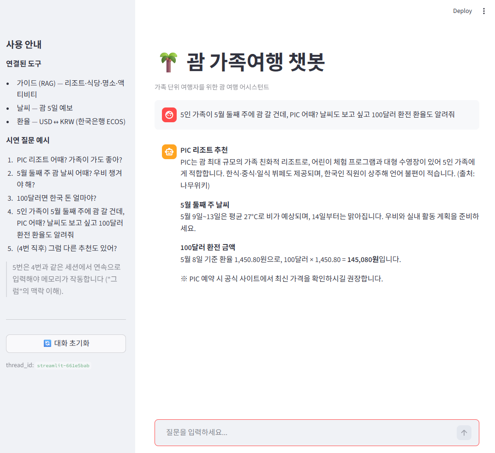

# 괌 가족여행 챗봇

LangChain 기반 **괌 여행 정보 Q&A 챗봇**입니다. 괌 여행 시 흩어져 있는 정보(가이드·날씨·환율)를 한 곳에서 묻고 답받을 수 있도록 RAG + Agent로 구현한 LLM 응용 프로젝트입니다. 초기 설계 시 5인 가족(부부 + 어린 자녀 3명) 시나리오를 가정해 구체화했습니다.

> **발표일**: 2026-05-11 — 패스트캠퍼스 AI 부트캠프 LLM 강의 개인 프로젝트

## 데모



### 시연 시나리오 5개

도구 다양성을 보이도록 설계했습니다.

| # | 질문 | 사용 도구 |
|---|---|---|
| 1 | "PIC 리조트 어때? 가족이 가도 좋아?" | search_guam_guide (RAG) |
| 2 | "5월 둘째 주 괌 날씨 어때? 우비 챙겨야 해?" | get_guam_weather |
| 3 | "100달러면 한국 돈 얼마야?" | convert_currency |
| 4 | "5인 가족이 5월 둘째 주에 괌 갈 건데, PIC 어때? 날씨도 보고 싶고 100달러 환전 환율도 알려줘" | RAG + 날씨 + 환율 (3개 멀티) |
| 5 | (4번 직후) "그럼 다른 추천도 있어?" | 메모리 (MemorySaver + thread_id) |

### #4 답변 예시 (Agent가 3개 도구를 스스로 골라 호출)

> **PIC 리조트 추천**
> PIC는 괌 최대 규모의 가족 친화적 리조트로, 어린이 체험 프로그램과 대형 수영장이 있어 5인 가족에게 적합합니다. 한식·중식·일식 뷔페도 제공되며, 한국인 직원이 상주해 언어 불편이 적습니다. (출처: 나무위키)
>
> **5월 둘째 주 날씨**
> 5월 9일~13일은 평균 27°C로 비가 예상되며, 14일부터는 맑아집니다. 우비와 실내 활동 계획을 준비하세요.
>
> **100달러 환전 금액**
> 5월 8일 기준 환율 1,450.80원으로, 100달러 × 1,450.80 = **145,080원**입니다.
>
> ※ PIC 예약 시 공식 사이트에서 최신 가격을 확인하시길 권장합니다.

### 환각 측정·시나리오 재설계

`05_agent_test.ipynb`의 측정 셀에서 같은 질문을 5회 반복 호출(매번 새 thread_id)하여 답변에 자료에 없는 가격·호텔명이 등장하는 빈도를 측정했습니다. 초기 #4("PIC 추천해줘. 4박 5일 30만원이면 충분해?")는 본문 직접 판정 4/5 환각이었으며, SYSTEM_PROMPT 강화·정규식 후처리 모두 한계가 측정으로 확인되어 시나리오를 가족 대화체로 재설계했습니다. 재설계 후 회귀 측정에서는 본문 판정 0/5 통과를 측정했지만, temperature=0인데도 호출마다 답변 변동이 있어 "환각 0"을 단정하기는 어렵습니다. 이는 학습 데이터의 prior가 시나리오 표현에 따라 강하게 활성화될 수 있다는 RAG 한계(강의 S6_1)를 측정으로 뒷받침하며, 본 프로젝트가 RAG·가드·시나리오 설계 세 축을 함께 동원해야 하는 본질적 이유입니다.

## 시스템 구조

```
사용자 질문
    ↓
Streamlit UI (app.py) / CLI (main.py)
    ↓
LangGraph create_react_agent (Solar-pro + ReAct)
    ↓
도구 3개 (Agent가 자동 선택)
├── search_guam_guide   (RAG, FAISS)
├── get_guam_weather    (OpenWeatherMap)
└── convert_currency    (한국은행 ECOS)
```

- **LLM**: Upstage Solar-pro (`temperature=0`, `max_tokens=512`)
- **Embedding**: UpstageEmbeddings (solar-embedding-1-large-query)
- **Vector Store**: FAISS (로컬, chunk_size=1200, 97청크)
- **Memory**: MemorySaver + thread_id (단일 세션 내 대화 흐름 유지)
- **Framework**: LangChain 1.x + LangGraph

## 폴더 구조

```
guam-family-chatbot/
├── README.md
├── requirements.txt
├── .env / .env.example
├── .gitignore
├── assets/
│   └── streamlit_demo.png
├── practice/                  # 탐색 노트북
│   ├── 01_collect_data.ipynb
│   ├── 02_build_index.ipynb
│   ├── 03_rag_test.ipynb
│   ├── 04_tools_test.ipynb
│   └── 05_agent_test.ipynb
├── src/guam_chatbot/
│   ├── __init__.py
│   ├── config.py              # LLM·Splitter·Tool 가드
│   ├── retriever.py
│   ├── agent.py
│   └── tools/
│       ├── __init__.py
│       ├── guide.py
│       ├── weather.py
│       └── currency.py
├── main.py                    # CLI 진입점
├── app.py                     # Streamlit UI (마크다운 ~ 후처리 포함)
└── data/                      # gitignore 처리
    ├── raw/
    └── faiss_index/
```

## 실행 방법

### 1. 가상환경 생성 + 활성화

```powershell
python -m venv .venv
.\.venv\Scripts\Activate.ps1
```

### 2. 의존성 설치

```powershell
pip install -r requirements.txt
```

### 3. 환경 변수 설정

`.env.example`을 복사해서 `.env` 파일을 만들고 API 키를 채웁니다.

```powershell
Copy-Item .env.example .env
```

### 4. 실행

```powershell
# CLI
python main.py

# Streamlit UI
streamlit run app.py
```

## 사용한 API

| API | 용도 | 발급 가이드 |
|---|---|---|
| Upstage Solar | LLM, Embedding | https://console.upstage.ai/ |
| OpenWeatherMap | 괌 5일 예보 (5-day / 3-hour Forecast 무료 엔드포인트) | https://openweathermap.org/api |
| 한국은행 ECOS | 환율 조회 (통계표 731Y001, 항목 0000001 USD) | https://ecos.bok.or.kr/ |

## 데이터 출처

본 프로젝트의 RAG 데이터베이스는 학습 목적의 비상업적 사용을 전제로, 한국 저작권법 28조("공표된 저작물의 인용") 및 일반 학술 관행 범위 안에서 다음 출처에서 정제하여 사용합니다. 모든 문서는 메타데이터에 출처 URL을 명시합니다.

총 28개 문서 / 86,496자 / 97개 청크 (FAISS 인덱스).

- 위키백과 한국어/영문 "Guam" (2개, CC BY-SA)
- Wikivoyage 영문 "Guam" (22개 섹션, CC BY-SA)
- 나무위키 "퍼시픽 아일랜드 클럽" (1개, CC BY-NC-SA 2.0 KR — 비상업 학술 맥락에서 사용)
- PIC 공식 사이트 www.pic.co.kr (3개 — 리조트 소개·골드카드 패스·워터파크 시설)

> 외교부 0404.go.kr·괌정부관광청·블로그·트립어드바이저·마이리얼트립은 라이선스(공공누리 적용 범위), robots.txt(이용약관 위반), 시연 가치 측정 결과를 검토한 끝에 본 프로젝트에서는 추가하지 않았습니다.

데이터 파일은 `.gitignore`로 처리되어 GitHub 저장소에는 포함되지 않습니다.

## 향후 확장

본 프로젝트는 강의 메시지 "작게 시작해 끝까지 완성"에 따라 처음부터 Level 2 (RAG + 단일 Agent + 도구 3개) 범위로 설계해서 6일 안에 완성했습니다. 만들고 나서 보니, 도구를 더 붙이고 단일 Agent를 멀티 에이전트로 분리하면 "5인 가족 4박5일 일정 자동 생성기"까지 확장할 수 있는 방향이 보였습니다 — 구체적으로는 다음과 같습니다.

- **웹 검색 도구 추가** — Tavily Search API
- **비행 검색 도구 추가** — Skyscanner / Amadeus API
- **숙소 가격 검색 도구 추가** — Booking.com / Hotels.com Affiliate API
- **일정 구조화** — Pydantic schema로 day-by-day 일정 정의 + LLM이 채움
- **멀티 에이전트 분리** — 리서치 / 일정 설계 / 검증(예산·동선·날씨) Agent
- **인터랙티브 UI** — Streamlit에 일정 카드형 표시 + 사용자 수정 가능

현재 시연 #4 ("5인 가족이 5월 둘째 주에 괌 갈 건데...") 가 위 확장 방향의 축소판입니다 — 도구 3개를 동시에 호출하는 패턴이 일정 생성기의 기본 구성 단위.

## 라이선스

패스트캠퍼스 강의 과제로 작성된 학습용 프로젝트입니다.